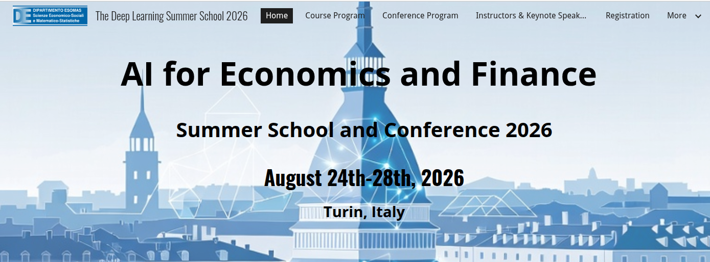

Summer School on [AI for Economics and Finance](https://sites.google.com/carloalberto.org/deeplearningsummerschool2026), held at [ESOMAS](https://www.esomas.unito.it/do/home.pl), August 24 - 26, 2026, at the University of Torino, followed by a [conference](https://sites.google.com/carloalberto.org/deeplearningsummerschool2026/conference-program) on August 27 - 28, 2026.

## At a glance

| | |
|------|------|
| **Summer school** | Monday to Wednesday, August 24 - 26, 2026 |
| **Conference** | Thursday to Friday, August 27 - 28, 2026 |
| **Venue** | Classrooms 7 and 8, SME building, Corso Unione Sovietica 218bis, 10134 Torino |
| **Format** | Interactive, workshop-like lectures with hands-on coding exercises |
| **Computing** | Python on the [Nuvolos](https://nuvolos.com) cloud, no local setup required |
| **Website** | [sites.google.com/carloalberto.org/deeplearningsummerschool2026](https://sites.google.com/carloalberto.org/deeplearningsummerschool2026) |
| **Contact** | <deeplearningconf26@gmail.com> |

## Contents

* [About the summer school](#about-the-summer-school)
* [Preparing for the school](#preparing-for-the-school)
* [Schedule](#schedule)
  * [Day 1, Monday, August 24th, 2026](#day-1-monday-august-24th-2026)
  * [Day 2, Tuesday, August 25th, 2026](#day-2-tuesday-august-25th-2026)
  * [Day 3, Wednesday, August 26th, 2026](#day-3-wednesday-august-26th-2026)
  * [The conference, August 27 - 28, 2026](#the-conference-august-27---28-2026)
* [Practical information](#practical-information)
* [People](#people)

## About the summer school

### Purpose

* The summer school is designed to equip Ph.D. students and researchers in economics, finance, and related fields with the computational tools that are rapidly transforming modern economic and financial research.
* By integrating **applied mathematics**, **machine learning**, and **computational economics**, the lectures provide a deep dive into two complementary frontiers: solving and estimating complex dynamic stochastic models, and leveraging **artificial intelligence**, **natural language processing**, and **large language models** to tackle empirical questions in economics and finance.
* The format of the lectures is interactive and workshop-like, combining theoretical discussions with guided, hands-on coding exercises, complemented by an **industry talk**.
* The coding is conducted in Python and implemented on the cloud computing infrastructure [Nuvolos](https://nuvolos.com), so that no local setup is required.

### Core pillars of the program

**1. Deep Learning for Solving and Estimating Dynamic Stochastic Models (days 1 and 2)**

The first half of the course focuses on using neural network architectures to solve high-dimensional economic problems:

* **Deep Equilibrium Nets and Deep Surrogates**: solving dynamic stochastic models, with guided coding exercises, followed by the use of deep surrogates for the *estimation* of such models.
* **Heterogeneous agent models**: how machine learning, specifically DeepHAM and structural reinforcement learning, efficiently solves models that were previously computationally intractable.
* **PDEs and continuous-time models**: physics-informed neural networks (PINNs) for solving partial differential equations, alongside dedicated deep learning techniques for continuous-time frameworks in economics and finance.

**2. Large Language Models and Sequence Modeling for Economics and Finance (days 2 and 3)**

The second half shifts to the processing of unstructured data, from the foundational mathematics to modern autonomous agents:

* **Foundations of sequence modelling**: the mathematical backbone of time series and language, from RNNs and LSTMs to the Transformer architecture.
* **The LLM revolution**: the pre-training paradigm, BERT and GPT architectures, scaling laws, and the emergent abilities of large models.
* **Domain adaptation**: adapting general-purpose models for financial and climate intelligence using parameter-efficient fine-tuning (LoRA) and human-intent alignment (RLHF/DPO).
* **Advanced frontiers and applications**: beyond basic prompting to retrieval-augmented generation (RAG), agentic LLMs (planning and tool use), and practical applications of deep sequence modelling in finance.

### Expected outcomes

By the end of the summer school, participants will have developed a dual skill set, whether they are exploring macroeconomic policy simulations, estimating heterogeneous agent models, or using modern LLMs to extract actionable intelligence from corporate disclosures.

### Teaching philosophy

The lectures will be interactive, in a workshop-like style, using [Python](http://www.python.org), [scikit learn](https://scikit-learn.org/), [PyTorch](https://pytorch.org/), and [Hugging Face Transformers](https://huggingface.co/docs/transformers) on [Nuvolos](http://nuvolos.cloud), a browser-based cloud infrastructure in which files, datasets, code, and applications work together, in order to directly implement and experiment with the introduced methods and algorithms.

## Preparing for the school

### Prerequisites

* Basic econometrics.
* Basic programming in Python (see [this link to QuantEcon](https://python-programming.quantecon.org/intro.html) for a thorough introduction).
* A brief Python refresher is provided [under this link](python_refresher).
* A brief introduction to Jupyter Notebooks is provided [under this link](python_refresher/jupyter_intro.ipynb).
* Basic calculus and probability.

### Recommended reading

* [Mathematics for Machine Learning](https://mml-book.github.io/), a good overview of the mathematical skills participants are expected to be fluent in.
* [Deep Learning](https://www.deeplearningbook.org/) (Goodfellow, Bengio, and Courville).

### Class enrollment on the [Nuvolos Cloud](https://nuvolos.cloud/)

* All lecture materials (slides, codes, and further readings) will be distributed via the [Nuvolos Cloud](https://nuvolos.cloud/).
* To enroll in this class, please click on the enrollment key (**TBA**), and follow the steps.

### What is in this repository

| Folder | Contents |
|------|------|
| [`day1/`](day1), [`day2/`](day2), [`day3/`](day3) | One folder per lecturer, each with `slides/`, `readings/`, and `code/` |
| [`python_refresher/`](python_refresher) | Self-study notebooks on Python basics and Jupyter |
| `screens/` | Images used in this README |

Lecture materials are added as the summer school approaches, and are also distributed via the Nuvolos Cloud.

## Schedule

> **Tentative, to be confirmed.** The final program will be published on the [summer school website](https://sites.google.com/carloalberto.org/deeplearningsummerschool2026/course-program).

### [Day 1](day1), Monday, August 24th, 2026

 **Time** | **Main Topics** | **Lecturer**
------|------|------
08:30 - 09:00 | Registration
09:00 - 09:10 | [Welcome by the organizers](day1/Trojani/slides) | Trojani
09:10 - 10:30 | [Introduction to Deep Equilibrium Nets](day1/Scheidegger/slides) | Scheidegger
10:30 - 11:00 | Coffee Break
11:00 - 12:30 | [Hands-on: guided exercises on Deep Equilibrium Nets for solving dynamic stochastic models](day1/Scheidegger/code) | Scheidegger
12:30 - 13:30 | Lunch Break
13:30 - 15:00 | [Deep Surrogates to Estimate Dynamic Models](day1/Scheidegger/slides) | Scheidegger
15:00 - 15:30 | Coffee Break
15:30 - 17:00 | Solving heterogeneous agent models with DeepHAM and structural reinforcement learning | Yang
19:00 - | Pizza Dinner

### [Day 2](day2), Tuesday, August 25th, 2026

 **Time** | **Main Topics** | **Lecturer**
------|------|------
09:00 - 10:30 | [Physics-informed Neural Nets (PINNs) for solving Partial Differential Equations](day2/Scheidegger/slides) | Scheidegger
10:30 - 11:00 | Coffee Break
11:00 - 12:30 | [Deep Learning for continuous-time models](day2/Yang/slides) | Yang
12:30 - 13:30 | Lunch Break
13:30 - 15:00 | [Foundations of Sequence Modelling: From RNNs to Transformers](day2/Leippold/slides) | Leippold
15:00 - 15:30 | Coffee Break
15:30 - 17:00 | Industry Talk | TBD
19:00 - | Informal Aperitivo/Drinks (self-organized and self-funded gathering for an aperitivo or drinks).

### [Day 3](day3), Wednesday, August 26th, 2026

 **Time** | **Main Topics** | **Lecturer**
------|------|------
09:00 - 10:30 | [The LLM Revolution: Scaling Laws and Modern Architectures](day3/Leippold/slides) | Leippold
10:30 - 11:00 | Coffee Break
11:00 - 12:30 | [Domain Adaptation: Building Financial & Climate Intelligence](day3/Leippold/slides) | Leippold
12:30 - 13:30 | Lunch Break
13:30 - 15:00 | [Advanced Frontiers: From RAG to Reasoning and Agentic LLMs](day3/Leippold/slides) | Leippold
15:00 - 15:30 | Coffee Break
15:30 - 17:00 | [Using Deep Sequence Modelling in Finance](day3/Trojani/slides) | Trojani

### The conference, August 27 - 28, 2026

Directly following the summer school, the *Deep Learning for Dynamic Stochastic Models* conference brings together scholars and practitioners working on high-dimensional, nonlinear, and stochastic models. The program features invited talks, contributed presentations, and panel discussions. See the [conference program](https://sites.google.com/carloalberto.org/deeplearningsummerschool2026/conference-program) for details.

## Practical information

### Venue

The summer school (and conference) will take place in Classrooms 7 and 8, located on the ground floor next to the main entrance of the SME building, at Corso Unione Sovietica 218bis, 10134 Torino.

### Registration, fees, and deadlines

Registration, the fee structure, and the application deadlines are all handled on the [summer school website](https://sites.google.com/carloalberto.org/deeplearningsummerschool2026), which is the authoritative source for these details.

### Accommodation

Participants are free to choose any accommodation they prefer. For convenience, a few options near the venue are listed below.

* **Hotel Astor**, Piazza Tancredi Galimberti 12, 10134 Torino. Offers a **special rate for guests affiliated with the University of Turin** during the summer school period. Accepted participants receive the booking instructions by email; if you have not received them, please contact <deeplearningconf26@gmail.com>.

Other nearby hotels (no special rates):

* **Hotel Original**, Via Arturo Farinelli 4, 10135 Torino
* **B&B Città Giardino**, Google Plus Code: 2J8C+WP, Turin
* **B&B da Malù**, Google Plus Code: 2J9W+MR, Turin
* **Hotel Cristallo**, Corso Traiano 28/9, 10135 Torino
* **Hotel Gran Torino**, Via La Loggia 6, 10134 Torino

### Getting to Torino

Torino is served by two major railway stations, both well connected:

* **Torino Porta Susa**, high-speed trains (Frecciarossa, Italo) from cities such as Milan and Rome.
* **Torino Porta Nuova**, centrally located, with high-speed (Frecciarossa, Italo) and regional connections.

Torino Airport (TRN) is connected to both stations by train and shuttle bus (approximately 30 - 45 minutes); see [SAGAT](https://www.aeroportoditorino.it/) for details.

### Getting to the venue

From the city center, the most convenient option is **Tram #4**, which runs frequently and passes through Via Milano, Via Arsenale, Via Sacchi, and Porta Nuova station. It continues south along Corso Unione Sovietica and stops at **Montevideo**, directly in front of the venue.

Tickets and info:

* Standard ticket: €1.90, valid for 100 minutes on trams, buses, and the metro.
* Purchase from Tabacchi (tobacconists), newsstands, or via the GTT TO Move app.
* No ticket? You can tap your contactless bank card on the validation machine inside the tram or bus. This costs €2.00 and is also valid for 100 minutes.

### Support and contacts

* For any organizational question, please write to the default email address of the summer school: <deeplearningconf26@gmail.com>
* For any question regarding whereabouts, local assistance, etc., there is a team of students that is available to help, and should be contacted via email: **TBA**
* For questions about the computing platform: Nuvolos Support, <support@nuvolos.cloud>

## People

### Lecturers

- [Markus Leippold](https://www.df.uzh.ch/en/persons/professorship/leippold.html) (University of Zurich and Swiss Finance Institute), <markus.leippold@df.uzh.ch>
- [Simon Scheidegger](https://sites.google.com/site/simonscheidegger/) (University of Lausanne and Grantham Research Institute, London School of Economics), <simon.scheidegger@unil.ch>
- [Fabio Trojani](https://www.unige.ch/gsem/en/research/faculty/all/fabio-trojani/) (University of Geneva and Swiss Finance Institute), <fabio.trojani@unige.ch>
- [Yucheng Yang](https://sites.google.com/site/yangyucheng1993/home) (University of Zurich and Swiss Finance Institute), <yucheng.yang@uzh.ch>

### Co-academic directors

- [Simon Scheidegger](https://sites.google.com/site/simonscheidegger/) (University of Lausanne and Grantham Research Institute, London School of Economics)
- [Fabio Trojani](https://www.unige.ch/gsem/en/research/faculty/all/fabio-trojani/) (University of Geneva and Swiss Finance Institute)

### Local organizers

- [Andrea Gallice](https://sites.google.com/carloalberto.org/andreagallice/home-page) (University of Turin and Collegio Carlo Alberto), Head of the Local Organizing Committee
- [Alessandro Milazzo](https://www.esomas.unito.it/do/home.pl) (University of Turin and Collegio Carlo Alberto)
- [Alessandro Ricchiuti](https://www.esomas.unito.it/do/home.pl) (University of Turin)
